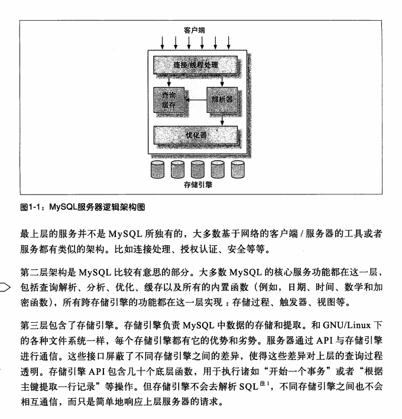

高性能MySQL



# 1.并发控制 

### 锁

当在系统中，有多个用户同时读取和修改同一张表时，需要进行并发控制。

在处理并发读或写时，可以通过实现一个由两种类型的锁组成的锁系统。

读锁（共享锁）相互不阻塞，多个用户可以在同时时间读取同一资源互不干扰

写锁（排它锁）一个写锁会阻塞其他的写锁和读锁，只有这样才能在给定的时间里只有一个用户执行操作，并防止其他用户在写入同一资源。

### 锁粒度

锁定需要修改的部分越精确，锁定的数据量越少，系统的并发程度就越高。

但是加锁也消耗相应的资源，需要系统花费大量的时间进行管理。因此锁策略就是在锁的开销和数据安全性之间寻找平衡。

表锁：基本锁策略，开销最小的策略，它会锁定整张表，一个用户在对表进行写操作（插入、删除、更新等）前。需要先获得写锁

行级锁：最大程度的支持并发同时带来了最大的开销。行级锁在存储引擎层实现，而MySQL服务器层没有实现

### 死锁

死锁指两个或多个资源互相占用，并请求锁定对方占用的资源，从而产生的恶性循环现象。当多个事物试图以不同顺序锁定资源，或多个事物锁定同一资源时。

A 系统检测到死锁的依赖返回错误

B当查询时间达到等待超时的设定后放弃锁请求

死锁发生后，只需重新执行因死锁回滚的事务

### 并发控制（mvcc）

保证每个事务看到的数据都是一致的。

乐观锁

乐观锁是相对悲观锁而言，也是为了避免数据库幻读、业务处理时间过长等原因引起数据处理错误的一种机制，但乐观锁不会刻意使用数据库本身的锁机制，而是依据数据本身来保证数据的正确性。

乐观锁可以通过时序法实现，即增加两个隐藏的列，一个保存行的创建时间，一个保存行的过期时间。每开始一个新的事物， 就使系统增加一个系统版本号，可通过比较版本号  来判断。

CAS（Compare and Swap）实现

CAS是项乐观锁技术，当多个线程尝试使用CAS同时更新同一个变量时，只有其中一个线程能更新变量的值，而其它线程都失败，失败的线程并不会被挂起，而是被告知这次竞争中失败，并可以再次尝试。

悲观锁

它指的是对数据被外界（包括本系统当前的其他事务，以及来自外部系统的事务处理）修改持保守态度

主要是共享锁和排他锁 悲观锁采用的是“先取锁再访问”的保守策略

但在效率方面比较低下 增增加了额外开销

详情参考地址：https://www.jianshu.com/p/d2ac26ca6525

## 1.3 事务

事务是一组原子性的SQL查询，或者说一个独立的工作单元。要么数据能成功的执行全部的语句，要么就所有语句都不会执行。

ACID表示原子性（atomicity）一致性（consistency）隔离性（isolation）持久性（durability）

原子性：一个事务必须被视为一个不可分割的最小工作单元，整个事务的所有操作要么会全部提交成功，要么全部回滚失败，对于一个事务来说，不可能只执行其中的一部分操作，这就是事务的原子性。

一致性：数据库从一个一致性的状态转换到另一个一致性状态。

隔离性：通常来说，一个事务所做的修改在最终提交之前都是对其他事务不可见的。

持久性：一旦事务提交，则其所做的修改就会永久保存到数据库中，此时即使系统崩溃，修改的数据也不会丢失。

### 1.3.1隔离级别

read uncommited(未提交读)

在此级别事务中的修改即使没有提交对其他事务也是可见的。事务可以读取未提交的数据，也称脏读

read committed(提交读)

模式为此模式。一个事务开始时只能看到已提交的事物所做的修改。一个事务从开始到提交之前，所做的任何修改对其他事务都是不可见的。

repeatable read(可重复读)

这种方式解决了脏读问题，但是仍旧不能解决幻读问题，即当某个事物在读取某个范围内的记录时，另一个事物又在该范围内插入了新的记录，当之前的事物再次读取范围的记录时，会产生幻行

serializable(可串行化)

这是最高级别的隔离。它通过强制事物串行执行，避免了前面的幻读问题。简单来说就是每个数据行都加上锁。

| 隔离级别 | 脏读可能性 | 不可重复读可能性 | 幻读可能性 | 加锁读 |
| :------: | :--------: | :--------------: | :--------: | :----: |
| 未提交读 |     Y      |        Y         |     Y      |   N    |
|  提交读  |     N      |        Y         |     Y      |   N    |
| 可重复读 |     N      |        N         |     Y      |   N    |
| 可串行化 |     N      |        N         |     N      |   Y    |

## 1.5 MySQL存储引擎

InnoDB

应用场景：如果应用对事务的完整性有较高的要求，在并发条件下要求数据的一致性，数据操作中包含读、插入、删除、更新，那InnoDB是最好的选择。在计费系统、财务系统等对数据的准确性要求较高的系统中被广泛应用。

优点：提供了具有提交（Commit）、回滚（Rollback）、崩溃恢复能力的事务安全，支持外键。

缺点：相比较于MyISAM，写的处理效率差一点，并且会占用更多的磁盘空间来存储数据和索引
特点：自动增长列 外键约束 存储方式 

MyISAM

应用场景：对事务的完整性没有要求，或以select、insert为主的应用基本都可以选用MYISAM。在Web、数据仓库中应用广泛

有点： 访问速度快

特点：不支持外键，事物，崩溃后无法安全恢复。

Archive

只支持insert 和 select 操作，适用于日志和数据采集类应用。这些往往需要扫描全表，或一些需要更加快速insert的场合

Memroy

数据存在内存，极大提高访问速度

支持的类型有限（不支持text和blob,对字符串只支持固定长度的 varchar会转换为char）

锁粒度为表级锁，并发写入能力差

存放于内存中， 重启后数据容易丢失。

# 2.MySQL基准测试

 2.1 为什么要有基准测试：对系统的性能做出一个大概的评估， TPS(每秒事务数)

2.2 基准测试的策略：主要有两种，一种是对整个系统进行测试（集成式基准测试），二是单独测试MySQL(单组件式基准测试)。 1.测试何种指标： 1.吞吐量：指的是单位时间内的事务处理数。 2.响应时间或延迟：这个指标用于测试任务所需的整体时间。计算出平均响应时间、最小响应时间、最大响应时间和所占百分比等。 3.并发性：Web服务器的并发性也不等同于数据库的并发性，而仅仅表示回话存储机制能够处理多少数据的能力。 Web服务器的并发性更正确的度量指标，应该是在任意时间有多少同时发生的并发请求。Web服务器的高并发，一般也会导致数据库的高并发。 4.可拓展性： 归根结底，应该测试那些对用户来说最重要的指标。


# 3. 服务器性能分析

```
3.1 性能优化简介：性能即响应时间。数据库服务器的目的是执行SQL语句，所以它关注的应该是查询或者语句，如SELECT,UPDATE ,DELETE等。
                    数据库的性能用查询的响应时间来度量，单位是每个查询花费的时间。
    
    1.通过性能剖析进行优化：
        两种类型的性能剖析：基于时间的分析和基于等待的分析。
  
    2.理解性能剖析：

3.2 对应用程序进行进行性能剖析：
 
3.3 剖析MySQL查询：
    1.剖析服务器负载
    2.剖析单条查询：
        set profiling = 1; 打开测量服务器中运行的所有的语句的运行时间，默认关闭。
        show profiles; 显示SQL语句的运行时间。（会发现每条语句都会创建一个id）
        show profile for query [id]; 详细显示这条语句（id）的运行时间。
        
        show status本身也会创建一条临时表
    3.使用性能剖析
  
3.4 诊断间歇性问题：比如系统偶尔停顿或者慢查询。
    1.使用 SHOW GLOBAL STATUS
```